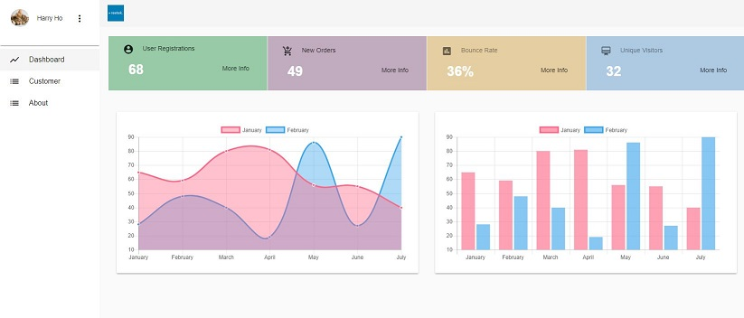
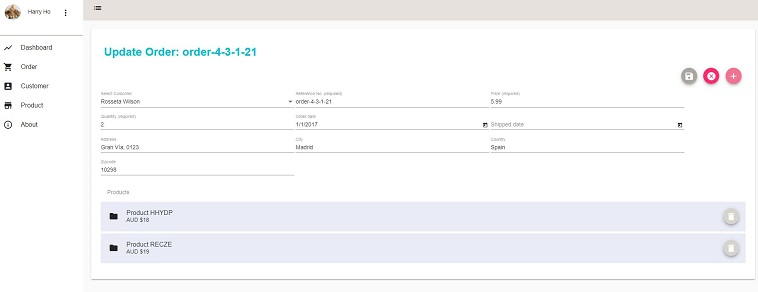

# Angular Material Design App

> A reusable CRM starter project for real-world business based on Angular 5, Angular-Material 5.

#### Features

* This project is built on the top of AngularClass/Angular-Starter.
* The UI part of this project is comprehensively built on Angular Material.
* This project includes ng-charts, progress-bar, confirmation dialog, etc.
* It uses Json-Server as fake Restful API. (You can simply replace it with your own API)
* CRUD functions for Customer, Order and Product.

#### Screenshots






## Build & Setup

```bash
# Clone project
git clone https://github.com/harryho/ng-md-app.git


# prepare Json-Server as fake Restful API
cd ng-md-app

# WINDOWS only. In terminal as administrator
npm install -g node-pre-gyp

# install the packages with npm
npm install

# Or use yarn (recommended)
yarn

# start the app
npm start

# serve with hot reload at localhost:3000
npm run dev


## You will see the following output. You can test the API with URLs via browser.
##
## \{^_^}/ hi!
##
## Loading db.json
## Done
##
## Resources
## http://localhost:5354/token
## http://localhost:5354/customers
## http://localhost:5354/orders
## http://localhost:5354/products
## http://localhost:5354/categories
##
## Home
## http://localhost:5354
##
## ...........................
## ...........................
## [at-loader] Checking started in a separate process...

## [at-loader] Ok, 0.002 sec.

# Access the Angular MD App at localhost:3000
```

# Welcome to fork or clone!
